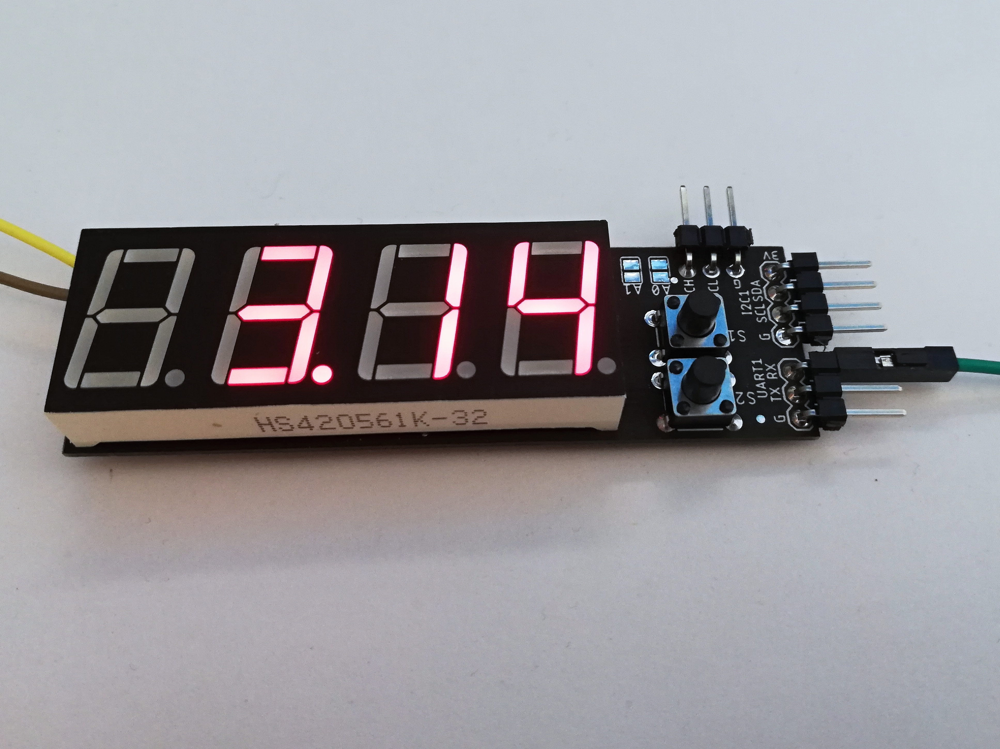

# Seven Segment Multifunction Display
*see the article [here](http://embedblog.eu/?p=282)*

## Description
A simple project, based on the ATmega88. Can show analog voltage in two ranges (0 - 6 V or 0 - 30 V) with < 1 % accuracy or can display characters sent to it via UART/I2C.
